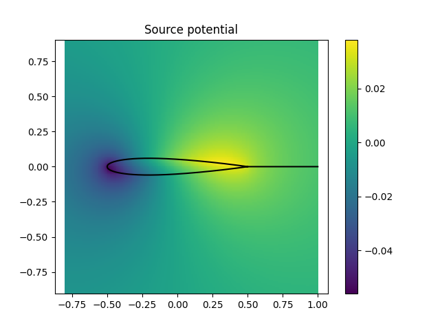
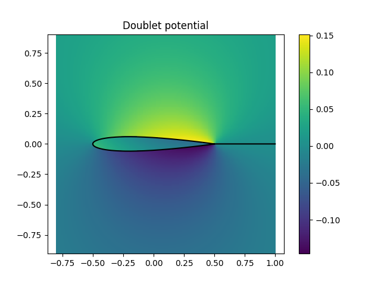
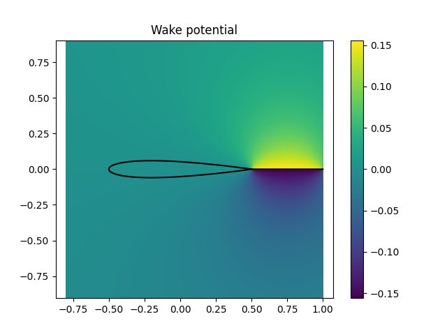
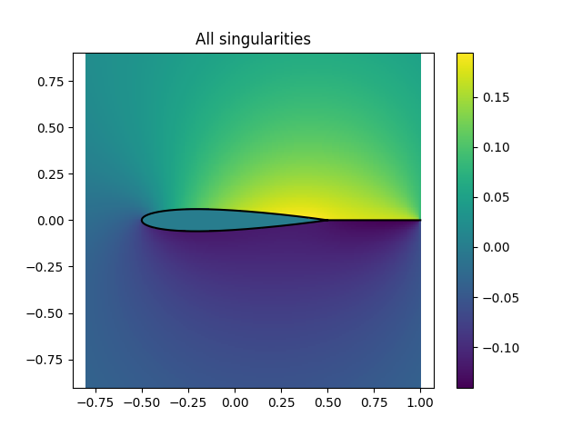
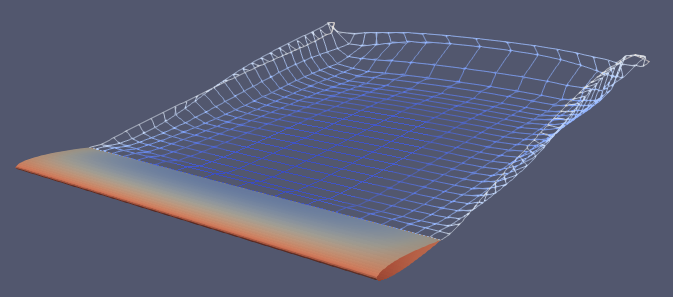
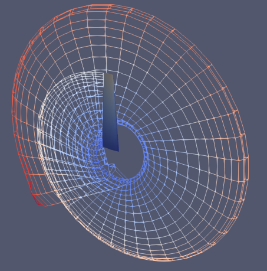

# pypm3D

A 3D panel method implementation for lifting surface calculations using a constant doublet/source distribution, linear Kutta condition and a free wake model. The Dirichlet boundary condition is applied.

## How to install:

To install the package from pip, use the code below:

### Linux
```python
pip3 install git+https://https://github.com/lucasralves/pypm3D
```

### Windows (not tested)
```python
pip3 install -e git+https://https://github.com/lucasralves/pypm3D#egg=pypm3D
```

## How to use:

```python
import pypm3D

vt = ...       # vertices
fc = ...       # faces
te = ...       # traling edge
l = 5.         # wake length
ts = 0.2       # pseudo time step

"""
Initialize some internal global parameters
"""
pypm3D.init()

"""
Create mesh parameters
"""
pypm3D.proc_mesh(vt, fc, te, u_call, l, ts)

"""
Solve the source/doublet distribution and calculate the surface parameters
"""
pypm3D.solve(u_call)

"""
Create a vtp file to be open in opened paraview
"""
pypm3D.gen_vtk('filename', True, u_call)
```

The geometry is represented by the parameters vt, fc, and te. All of them are numpy arrays as shown below:

```python
"""
Contain all vertices.
"""
vt = np.array([[x_1, y_1, z_1], ...], dtype=np.double)

"""
Contain the vertices ids that make a face. The ids must be ordered in a way that the face is posisitive oriented. The first parameter n's, is the number of sides that must be 3 or 4. If n == 3, then the last id (id4) will be replaced by -1.
"""
fc = np.array([[n1, id1, id2, id3, id4], ...], dtype=np.int32)

"""
Contain the pair of vertices ids that make an edge located at the trailing edge.
"""
te = np.array([[id1, id2], ...], dtype=np.int32)
```

## Singularities

The Figures below show the potential field in the middle section of a rectangule wing with 10.0 degress of AoA and a cross section profile of Naca 0012. The sources strength are calculated based on the freestream normal velocity, and the doublets strength are calculated to ensure a zero potential inside the body and the Kutta condition. The source and doublet are distributed over the surface and only doublet are used in the wake.

<p float="left">
  
  
</p>

<p float="left">
  
  
</p>

## Examples

The Figures below were generated based on the scripts in 'examples' folder and visualized using the vtp files in paraview.

### Rectangular Wing



### Wind Turbine



## References

[1] Katz, J., Plotkin, A. (2001). Low-Speed Aerodynamics. Cambridge University Press.